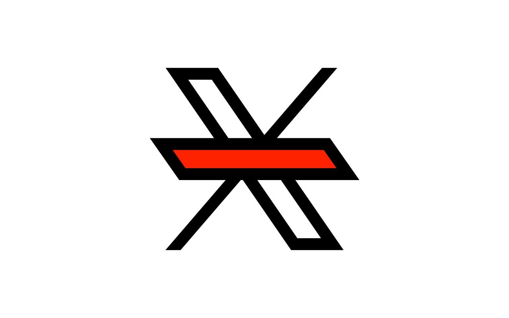

# X Tab Fixer

> **X (Twitter) "For You" Remover.** A Chrome extension that removes the "For You" tab from X (formerly Twitter) and automatically switches to the "Following" timeline.

### 🚫 Say goodbye to the “For You” algorithm.

**X Tab Fixer** is a simple, lightweight extension that removes the *"For You"* tab from the top of your feed and ensures you're on the *"Following"* tab by default. 

This extension does not collect any user data and operates solely on the page content of X.com. **No tracking, no data collection, no bloat**.

## Installation

1. Download or clone this repository
2. Open Chrome and go to `chrome://extensions/`
3. Enable "Developer mode" in the top right corner
4. Click "Load unpacked" and select the extension directory

---

&mdash; [@alterebro](https://x.com/alterebro) 