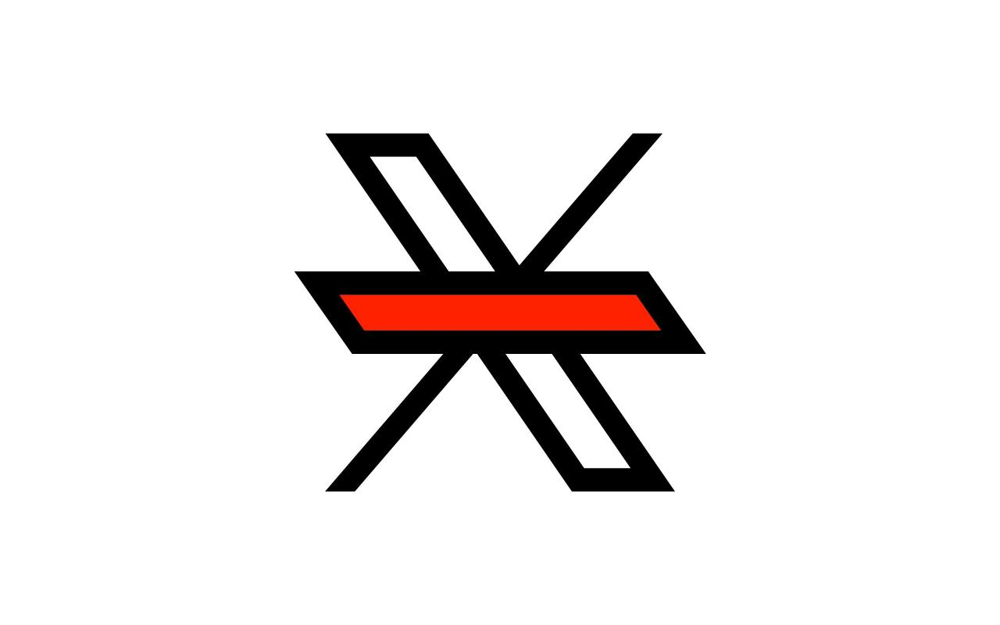

# Bye 'For You' 👋 

## Remove the "For You" Tab on X (formerly Twitter)

> A Browser extension that removes the "For You" tab from X and defaults to the "Following" timeline.


- **Chrome Extension** : [chromewebstore.google.com/detail/fjliicemokgekhghidligclkcapijldf](https://chromewebstore.google.com/detail/fjliicemokgekhghidligclkcapijldf)
- **Mozilla Add-on** : [addons.mozilla.org/addon/bye-for-you](https://addons.mozilla.org/addon/bye-for-you/)


### 🚫 Say goodbye to the “For You” algorithm.

_**Bye "For You"**_ is a simple and lightweight browser extension that removes the *"For You"* tab from the top of your feed and switches you back to the *"Following"* tab so you follow only who you actually follow.

This extension does not collect any user data and operates solely on the page content of X.com. **No tracking, no data collection, no bloat**.




## 🧩 Language Support & Contributions

This extension currently supports the following interface languages:

- **English**
- **Spanish**
- **French**

If you use X in another language and want the extension to work for you too, you can help!
<br />Open a [Pull Request](https://github.com/alterebro/bye-for-you/pulls) or [Issue](https://github.com/alterebro/bye-for-you/issues) with the translations used for the "For You" and "Following" tabs, including the language code:

```js
'es': { forYou: 'Para ti', following: 'Siguiendo' }
```

Your contribution will help users around the world escape the "For You" trap.
<br />Thanks for helping improve digital sanity! 🙌


## 🛠️ Installation

1. Download or clone this repository
2. Open Chrome and go to `chrome://extensions/`
3. Enable "Developer mode" in the top right corner
4. Click "Load unpacked" and select the extension directory


---

&mdash; [@alterebro](https://x.com/alterebro) 